# Hi, I'm Austin 👋

Happiness Engineer at [Automattic](https://automattic.com) — I help people build things on WordPress.com.
I spend my free time contributing to open source projects, self-hosting everything, and automating the boring parts.

**Florida** · [austingilmour.com](https://austingilmour.com)

---

### Tech I work with

### Self-hosted stack

---

### Open source contributions

Projects I've contributed to:

- [Kometa-Team/Kometa](https://github.com/Kometa-Team/Kometa) — Plex metadata manager
- [Taxel/PlexTraktSync](https://github.com/Taxel/PlexTraktSync) — Plex ↔ Trakt sync
- [DevinVinson/WordPress-Plugin-Boilerplate](https://github.com/DevinVinson/WordPress-Plugin-Boilerplate) — WP plugin scaffold
- [jbrodriguez/unbalance](https://github.com/jbrodriguez/unbalance) — Unraid disk balancer
- [linuxserver/Heimdall](https://github.com/linuxserver/Heimdall) — self-hosted dashboard
- [johnbillion/query-monitor](https://github.com/johnbillion/query-monitor) — WordPress debugging
- [AdguardTeam/AdGuardHome](https://github.com/AdguardTeam/AdGuardHome) — network-wide ad blocking

---

### GitHub stats

  
  

